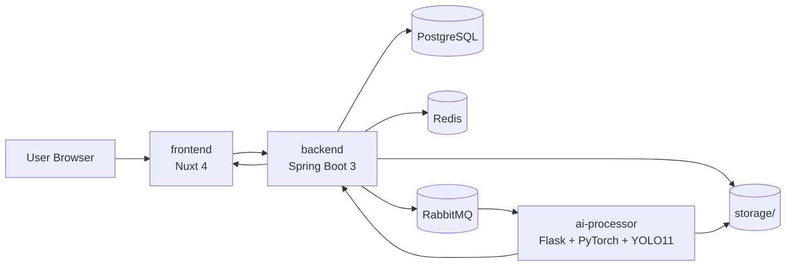
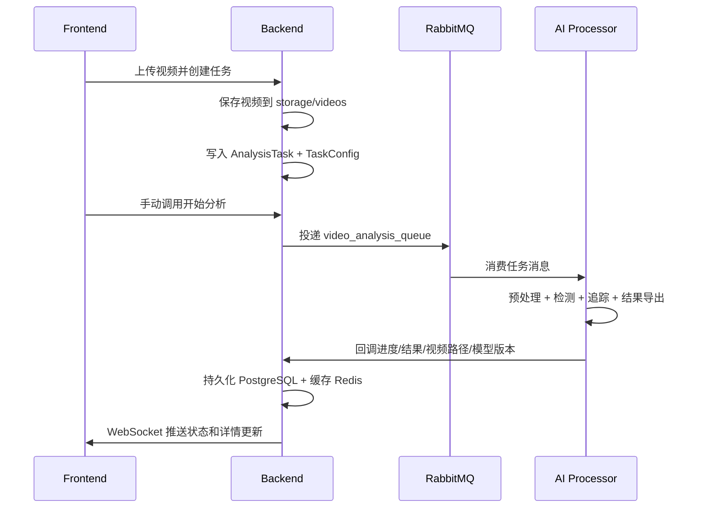

# 项目接手、开发测试与部署指南

本文档面向第一次接手本项目的工程师，尤其是对 Docker、Git、Java、Node.js 不熟悉的接手人员。  
目标不是让你“读懂所有代码”，而是让你按顺序完成三件事：

1. 把本地开发环境搭起来
2. 把本地测试链路跑通
3. 在测试通过之后再部署到生产环境

如果你跳过测试直接部署，那不是效率高，那是拿生产环境替你做实验。

## 1. 项目概览

### 1.1 系统组成

本项目不是单体仓库，而是一个主仓库加三个 Git submodule 的组合系统：

- `frontend`：负责上传、任务列表、任务详情、结果展示、WebSocket 实时状态
- `backend`：负责任务管理、视频保存、数据库持久化、Redis 缓存、RabbitMQ 投递、WebSocket 推送、视频流接口
- `ai-processor`：负责视频预处理、YOLO 检测、轨迹追踪、结果视频导出、回调后端

### 1.2 架构图



### 1.3 业务主链路



### 1.4 关键事实

- `backend`、`frontend`、`ai-processor` 都是 Git submodule
- “上传任务”和“开始分析”是两个动作，不会自动连起来
- `docker-compose.dev.yml` 只负责中间件
- 生产部署需要在 `docker-compose.prod.yml` 和 `docker-compose.prod.cpu.yml` 之间明确二选一
- 根目录 `docker-compose.yml` 是生成文件，禁止手工维护

## 2. 接手前必须知道的基础知识

### 2.1 Git：你必须知道什么是 submodule

本项目主仓库只负责组织三个子项目。如果你只执行：

```bash
git clone <repo-url>
```

很容易出现目录在，但子模块代码不完整的情况。正确姿势是：

```bash
git clone --recurse-submodules https://github.com/jjhhyyg/VAR-melting-defect-detection-source-code.git
```

如果你已经拉错了：

```bash
git submodule update --init --recursive
```

修改 submodule 时要记住一件事：

1. 先进入 submodule 提交代码
2. 再回主仓库提交 submodule 指针

如果你只在主仓库提交，不在子仓库提交，别人拉到的还是旧代码。

### 2.2 Docker：这里只需要懂和本项目有关的部分

- `image`：镜像，服务运行所需的模板
- `container`：容器，镜像启动后的实际运行实例
- `volume`：数据卷，用来持久化数据库数据或共享文件
- `docker compose`：一次启动多个容器的编排工具

本项目中：

- 开发阶段：只用 Docker 启 PostgreSQL、Redis、RabbitMQ
- 部署阶段：用 Docker Compose 启整套服务
- 上传视频、预处理视频、结果视频依赖共享存储目录

常用命令：

```bash
docker compose -f docker-compose.dev.yml up -d
docker compose -f docker-compose.dev.yml ps
docker compose -f docker-compose.dev.yml logs -f
docker compose -f docker-compose.dev.yml down
```

### 2.3 Java / IntelliJ IDEA：只学本项目需要的最小操作

后端技术栈：

- Java 21
- Spring Boot 3.5.6
- Maven Wrapper
- PostgreSQL + Flyway
- Redis
- RabbitMQ

建议使用 IntelliJ IDEA 调试后端，步骤如下：

1. 用 IntelliJ IDEA 打开 `backend` 目录
2. 在 `Project SDK` 中配置 JDK 21
3. 等待 IDEA 识别为 Maven 项目
4. 确认 `.env` 已由根目录脚本生成到 `backend/.env`
5. 直接运行 `BackendApplication`
6. 在 IDEA 控制台观察 Spring Boot 日志、Flyway 迁移、RabbitMQ 连接信息

适合用 IDEA 启动的场景：

- 需要打断点
- 需要看数据库迁移日志
- 需要看 WebSocket、Redis、RabbitMQ 相关启动日志

适合用命令行启动的场景：

- 快速验证服务能否启动
- 脚本化运行

命令行方式：

```bash
cd backend
./mvnw spring-boot:run
```

健康检查与文档：

- 健康检查：`http://localhost:8080/actuator/health`
- Swagger：`http://localhost:8080/swagger-ui.html`

### 2.4 Node.js / WebStorm：只学本项目需要的最小操作

前端技术栈：

- Nuxt 4
- Vue 3
- TypeScript
- Nuxt UI
- STOMP.js + SockJS

建议使用 WebStorm 调试前端，步骤如下：

1. 用 WebStorm 打开 `frontend` 目录
2. 配置 Node.js 解释器
3. 执行 `npm install`
4. 确认 `.env` 已生成到 `frontend/.env`
5. 配置并运行 `npm run dev`
6. 在 WebStorm 终端或运行面板中观察日志
7. 用浏览器访问页面，并配合开发者工具查看接口请求和 WebSocket

适合用 WebStorm 的场景：

- 调整页面与组件
- 观察接口请求
- 观察 WebSocket 连接与前端报错

命令行方式：

```bash
cd frontend
npm install
npm run dev
```

本项目当前更建议以 `npm` 为主，因为仓库包含 `package-lock.json`，Docker 构建也使用 `npm ci`。

### 2.5 Python / AI 模块：够用就行

AI 模块本地开发主要靠命令行，重点是：

- Python 3.9+，建议使用独立虚拟环境或 Conda
- 本地需要安装 Python 依赖
- 模型权重默认路径是 `ai-processor/weights/best.pt`
- 设备选择由 `YOLO_DEVICE` 控制，可设为 `cuda`、`mps`、`cpu` 或留空自动选择

启动方式：

```bash
cd ai-processor
pip install -r requirements.txt
python app.py
```

健康检查：

```bash
curl http://localhost:5000/health
```

如果你想调试 AI 逻辑，可以在 PyCharm 或带 Python 插件的 IDEA 中看：

- `app.py`
- `mq_consumer.py`
- `analyzer/video_processor.py`

但本项目主要联调方式仍然是命令行 + 日志。

## 3. 开发阶段指南

### 3.1 开发阶段目标

开发阶段的目标只有三个：

1. 环境能启动
2. 模块能调试
3. 三端能连通

开发阶段不允许直接跳到部署阶段。

### 3.2 开发阶段推荐形态

- 数据层走 Docker：PostgreSQL、Redis、RabbitMQ
- 应用层本地直跑：backend、frontend、ai-processor

这样做的好处是：

- 中间件稳定
- 代码改动立即生效
- IDEA 和 WebStorm 调试更方便

### 3.3 本地开发步骤

#### 步骤 1：克隆仓库

```bash
git clone --recurse-submodules https://github.com/jjhhyyg/VAR-melting-defect-detection-source-code.git
cd VAR-melting-defect-detection-source-code
```

#### 步骤 2：生成开发环境变量

```bash
./scripts/use-env.sh dev
```

该脚本会：

- 生成根目录 `.env`，供 Docker Compose 使用
- 生成 `backend/.env`
- 生成 `frontend/.env`
- 生成 `ai-processor/.env`

#### 步骤 3：启动中间件

```bash
docker compose -f docker-compose.dev.yml up -d
```

查看状态：

```bash
docker compose -f docker-compose.dev.yml ps
```

#### 步骤 4：在 IntelliJ IDEA 启动后端

推荐做法：

1. 打开 `backend`
2. 配置 JDK 21
3. 确认 Maven 项目已加载
4. 运行 `BackendApplication`

备用命令：

```bash
cd backend
./mvnw spring-boot:run
```

#### 步骤 5：在 WebStorm 启动前端

推荐做法：

1. 打开 `frontend`
2. 执行 `npm install`
3. 配置 Node.js 解释器
4. 运行 `npm run dev`

备用命令：

```bash
cd frontend
npm install
npm run dev
```

#### 步骤 6：启动 AI 模块

```bash
cd ai-processor
pip install -r requirements.txt
python app.py
```

#### 步骤 7：验证三端联通

必须至少验证：

- 前端首页打开正常
- 后端健康检查正常
- AI 健康检查正常
- RabbitMQ 管理界面可访问

### 3.4 开发时常看的目录

- `env/`：环境变量模板
- `scripts/`：环境切换脚本
- `storage/`：原视频、预处理视频、结果视频
- `docker-compose*.yml`：不同阶段部署入口

源码入口建议：

- 上传参数、任务字段：`frontend/app/composables/useTaskApi.ts`、`backend/.../TaskUploadRequest.java`
- 任务状态和 WebSocket：`frontend/app/composables/useWebSocket.ts`、`backend/.../WebSocketConfig.java`
- AI 分析流程：`ai-processor/mq_consumer.py`、`ai-processor/analyzer/video_processor.py`
- 视频流接口：`backend/.../VideoController.java`

## 4. 测试阶段指南

### 4.1 测试阶段目标

测试阶段的目标不是“服务没报错”，而是“关键业务链路真实跑通”。

### 4.2 当前测试现实

这里必须直说：这个项目当前自动化测试覆盖并不强。

- 后端有基础 Maven 测试入口，但覆盖有限
- 前端以 `lint`、`typecheck` 和手工联调为主
- AI 模块当前缺少成体系的自动化测试

所以接手人员不能偷懒，必须做完整的本地冒烟和联调测试。否则部署阶段就是瞎赌。

### 4.3 环境检查

先确认这些事实：

- 根目录 `.env` 已生成
- `backend/.env`、`frontend/.env`、`ai-processor/.env` 已生成
- PostgreSQL、Redis、RabbitMQ 都是健康状态
- `ai-processor/weights/best.pt` 存在
- 端口 `3000`、`5000`、`8080`、`15672` 没有冲突

检查建议：

```bash
docker compose -f docker-compose.dev.yml ps
ls ai-processor/weights/best.pt
```

### 4.4 后端测试

#### 自动化基础测试

```bash
cd backend
./mvnw test
```

#### 手工检查

- 打开 `http://localhost:8080/actuator/health`
- 打开 `http://localhost:8080/swagger-ui.html`
- 观察启动日志，确认 Flyway migration 成功
- 调用任务列表接口，确认后端能正常返回数据

### 4.5 前端测试

执行：

```bash
cd frontend
npm run lint
npm run typecheck
```

手工检查：

- 首页能打开
- 任务列表能加载
- 网络请求正常发往后端
- WebSocket 连接能建立
- 任务详情页能正常展示任务状态和结果

### 4.6 AI 模块测试

手工检查：

- `http://localhost:5000/health` 返回正常
- `model_loaded` 为真
- 当前设备识别正确
- MQ 消费线程启动正常
- 日志中没有明显的模型加载失败或连接失败错误

### 4.7 端到端联调测试

必须用一个真实测试视频跑完整链路。

#### 推荐测试流程

1. 在前端上传一个测试视频
2. 确认任务创建成功，状态为 `PENDING`
3. 手动点击或调用“开始分析”
4. 观察任务进入 `PREPROCESSING` 或 `ANALYZING`
5. 检查 RabbitMQ 管理界面，确认消息被消费
6. 检查 AI 日志，确认开始分析
7. 检查后端日志，确认接收进度回调
8. 检查前端页面，确认状态与进度实时更新
9. 任务完成后检查：
   - 结果视频是否生成
   - 任务详情页是否能显示指标和事件
   - 结果视频是否能播放

#### 建议再做一个失败场景

例如：

- 暂停 RabbitMQ 或 AI 模块
- 观察任务停滞时各模块日志表现
- 确认问题是否可定位

如果失败场景都定位不了，你上线后出问题也大概率定位不了。

### 4.8 部署前检查清单

下面清单未全部通过前，禁止部署：

- [ ] 已使用 `--recurse-submodules` 正确拉取仓库
- [ ] 如果本次是修复 bug，且使用了 Codex、Claude 或类似 coding agent，已从 `main` 新建独立分支，而不是直接在 `main` 上修改
- [ ] 已执行 `./scripts/use-env.sh dev`
- [ ] PostgreSQL、Redis、RabbitMQ 启动且健康
- [ ] backend、frontend、ai-processor 都能本地启动
- [ ] `backend/.env`、`frontend/.env`、`ai-processor/.env` 已生成
- [ ] `ai-processor/weights/best.pt` 存在
- [ ] 后端健康检查通过
- [ ] Swagger 可访问
- [ ] 前端首页可访问
- [ ] AI 健康检查通过
- [ ] 至少完成一次真实视频上传
- [ ] 至少完成一次手动开始分析
- [ ] 至少完成一条任务完整跑通
- [ ] 结果视频可访问并可播放
- [ ] 关键日志中没有阻塞性错误
- [ ] 如果本次是 bug 修复，已在独立分支上完成本地验证，且准备在生产环境验证无误后再合并回 `main`

## 5. 部署阶段指南

### 5.1 部署阶段前提

只有在测试阶段通过后，才允许进入部署。

部署前必须确认：

- 已执行 `./scripts/use-env.sh prod`
- 生产环境变量已经检查
- `ai-processor/weights/best.pt` 已准备好
- 你知道自己要走 GPU 路径还是 CPU 路径
- 若使用 `backend/Dockerfile`，本地已经构建好后端 JAR

### 5.2 生产环境变量准备

切换到生产环境：

```bash
./scripts/use-env.sh prod
```

重点检查：

- `env/shared/.env.production`
- `env/backend/.env.production`
- `env/frontend/.env.production`
- `env/ai-processor/.env.production`

### 5.3 GPU 部署路径

适用场景：

- 生产环境有 NVIDIA GPU
- 容器 runtime 已正确配置 GPU 能力
- 希望获得更好的 AI 推理性能

使用文件：

- `docker-compose.prod.yml`

#### 部署前置

如果使用默认后端 Dockerfile，需要先构建 JAR：

```bash
cd backend
./mvnw clean package -DskipTests
cd ..
```

如果你不想本地先构建，可以改用：

```bash
BACKEND_DOCKERFILE=Dockerfile.build docker compose -f docker-compose.prod.yml up -d --build
```

默认部署命令：

```bash
docker compose -f docker-compose.prod.yml up -d --build
```

查看状态：

```bash
docker compose -f docker-compose.prod.yml ps
docker compose -f docker-compose.prod.yml logs -f
```

### 5.4 CPU 部署路径

适用场景：

- 没有可用 GPU
- 先做兼容性部署或小规模验证

你必须明白：CPU 方案是兼容性方案，不是推荐的高性能生产方案。

使用文件：

- `docker-compose.prod.cpu.yml`

如果使用默认后端 Dockerfile，需要先构建 JAR：

```bash
cd backend
./mvnw clean package -DskipTests
cd ..
```

部署命令：

```bash
docker compose -f docker-compose.prod.cpu.yml up -d --build
```

查看状态：

```bash
docker compose -f docker-compose.prod.cpu.yml ps
docker compose -f docker-compose.prod.cpu.yml logs -f
```

### 5.5 macOS 桌面端发布

如果目标是发布 `frontend` 里的 Tauri macOS 桌面端，不要套用上面的 Docker 部署流程。

桌面端发布必须单独阅读：

```text
docs/macOS桌面端发布指南.md
```

核心原则只有一句：`tauri dev` 是开发层，raw `tauri build` 是原始构建层，`frontend/scripts/macos-release.mjs` 才是这个仓库可信的 macOS 发布层。

### 5.6 部署后验收

部署完成后至少检查：

- 前端、后端、AI 容器健康状态
- PostgreSQL、Redis、RabbitMQ 正常
- 前端页面可访问
- 后端健康检查可访问
- AI 健康检查可访问
- 上传测试任务成功
- 分析任务可以开始并完成
- 结果视频可访问
- 前端页面展示正常

建议验收命令：

```bash
docker compose -f docker-compose.prod.yml ps
docker compose -f docker-compose.prod.yml logs -f backend
docker compose -f docker-compose.prod.yml logs -f ai-processor
```

如果使用 CPU 版本，把命令中的 Compose 文件替换为 `docker-compose.prod.cpu.yml`。

### 5.7 回滚与恢复

出问题时先干这几件事，不要上来就乱删数据：

1. 看容器状态：`docker compose ... ps`
2. 看关键日志：backend、ai-processor、rabbitmq
3. 看健康检查是否失败
4. 看是否是配置问题、权重缺失、JAR 缺失、GPU 不可用

可以单独重启单个服务，但如果根因没有定位清楚，不要假装“重启一下就算修好了”。

## 6. 常见故障排查

### 6.1 clone 后代码不全

原因：没有拉 submodule。

修复：

```bash
git submodule update --init --recursive
```

### 6.2 改了 `env/` 但服务不生效

原因：你只改了模板，没有重新执行环境切换脚本。

修复：

```bash
./scripts/use-env.sh dev
```

或：

```bash
./scripts/use-env.sh prod
```

### 6.3 任务一直停在 `PENDING`

优先检查：

- 是否已经手动开始分析
- 后端是否成功投递 RabbitMQ
- RabbitMQ 是否可用
- AI 模块是否真的在消费队列

### 6.4 AI 不消费消息

优先检查：

- RabbitMQ 连接配置
- AI 模块启动日志
- 模型权重是否存在
- 设备配置是否导致初始化失败

### 6.5 前端没有实时更新

优先检查：

- 后端 `/ws` 是否正常
- 浏览器中 STOMP / SockJS 是否成功连接
- 后端是否成功推送 `/topic/tasks/*`
- Redis 缓存与状态更新是否正常

### 6.6 视频打不开

优先检查：

- 后端 `/api/videos/{taskId}/{type}` 是否返回正常
- 数据库存储的视频路径是否有效
- 存储目录是否挂载正确

### 6.7 Docker 能跑，但 IDE 跑不起来

优先检查：

- IDEA 的 JDK 是否是 Java 21
- WebStorm 的 Node.js 解释器是否正确
- 项目工作目录是否选对
- `.env` 是否已经生成

## 7. 接手建议与维护规范

### 7.1 接手顺序建议

第一天建议这样做：

1. 先读根 README
2. 再读本文档
3. 然后按需读 `backend`、`frontend`、`ai-processor` README
4. 最后再深入代码

别一上来就扎进业务逻辑。你连环境和链路都没搞清楚，先冲代码，效率通常很差。

### 7.2 文档维护规则

以后只要改了下面这些内容，就必须同步改文档：

- 接口
- 环境变量
- Compose 文件
- 启动方式
- 部署流程
- 存储路径

如果只改代码不改文档，README 漂移一定会再次发生。

### 7.3 使用 Coding Agent 修复 Bug 的强制流程

如果你使用 Codex、Claude 或类似的 coding agent 修复 bug，必须遵守下面的流程，不能直接在 `main` 分支上修：

1. 从最新 `main` 新建独立 bugfix 分支
2. 在独立分支上让 agent 分析、修改和提交代码
3. 在该分支完成本地开发环境验证和完整测试
4. 只有在 bug 修复成功、关键本地测试通过后，才允许进入生产环境部署验证
5. 生产环境部署确认无误后，再将 bugfix 分支合并回 `main`

推荐命令示例：

```bash
git checkout main
git pull
git checkout -b fix/<bug-name>
```

这样做的原因很直接：

- agent 修复很容易带入额外改动
- bug 修复往往需要多轮试错
- 直接污染 `main` 会让回滚、审查、对比和责任定位都变得很恶心

如果你让 agent 直接在 `main` 上修 bug，那不是省事，是在降低整个项目的可维护性。

### 7.4 现实风险

这个项目当前最大的交接风险不是“代码太复杂”，而是：

- 自动化测试覆盖有限
- 多模块协作链路长
- 环境变量和部署路径多
- 一旦文档不跟着改，漂移会非常快

所以真正应该建立的不是“写过一次文档”，而是“文档必须跟代码一起维护”的纪律。
